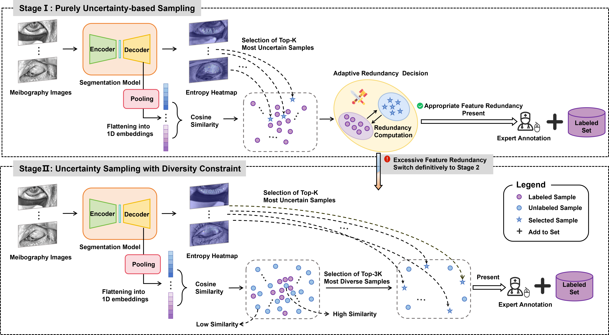
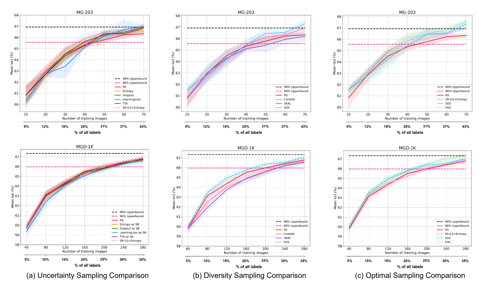

# AL-MGS
## Annotation-Efficient Meibomian Gland Segmentation via Active Learning

## 🧠 Introduction

<p align="center">
  
</p>

**🔍This study explores the application of AL in infrared meibography image segmentation and proposes a novel progressive hybrid sampling framework. First, to reduce random bias and the cold start problem, an initial labeled set is constructed by combining the image's inherent specular reflection prior. Then, a two-stage dynamic sampling strategy is implemented. At the initial AL iteration stages, the model queries the most uncertain samples guided by entropy to quickly improve performance while monitoring sample redundancy through an adaptive threshold. When redundancy becomes too high, the simple diversity sampling module is activated to enhance the model's generalization ability.**
 
 
  🏆 **Extensive experiments show that our method achieves optimal performance with the same annotation budget.**

## 🛠️ Environment
Training and evaluation environment: Python3.9.4, PyTorch 2.3.1, CUDA 12.4. Run the following command to install required packages.
```
pip3 install -r requirements.txt
```
## 🏕️ Data
We train and evaluate all our models on our internal private dataset MG-203 and the public dataset MGD-1K. The [MGD-1K](https://mgd1k.github.io/) dataset can be accessed online.

We assume the data folder (`datasets`) has the following structure:

```
datasets
├── <dataset_name> 
│ └── train
|     └── image
│         └── ...
|     └── label
│         └── ...
│ └── test
|     └── image
│         └── ...
|     └── label
│         └── ...
├── <dataset_name> 
│ └── train
|     └── image
│         └── ...
|     └── label
│         └── ...
│ └── test
|     └── image
│         └── ...
|     └── label
│         └── ...
```

## 🚀 Training 🔥🔥🔥

### 📌 Training and evaluation
We initiate the active learning process using the following command to iteratively query samples and train the U-Net model until reaching the predefined total cycle count. Additionally, we evaluate the optimal model on the test set after every cycle.
```
python3 src/main.py
```

### 📝 Main training arguments
Prior to initiating active learning, certain input parameters in `main.py` require case-specific configuration.

Input of `main.py`:
```
# These are the paths to the data and output folder
--data_dir        # path to the dataset repository
--output_dir      # path to output directory for runtime results

# These are config file names located in src/Config
--data_config     # dataset configuration file 
--model_config    # model (U-Net) parameter configuration file
--train_config    # training parameter config 
--sampling_config # select the sampling strategy (We provide all sampling strategies used in our paper, including ablation studies.)
--logger_config   # logger configuration file 
--initial_set_construction_criteria           # we provide two initial labeled set selection strategies: RS or SR-ILS

# Additional training configs (seed and gpu)
--seed         # We employ fixed random seeds to ensure experimental reproducibility.
--num_gpu      # number of GPU devices to use
--gpu_idx      # gpu index

 # Note: Training hyper-parameters that we should change according to the dataset
--model__out_channels             # number of output channels
--train__loss__normalize_fct      # softmax or sigmoid
--train__loss__n_classes          # number of output classes (depends on data)
```

## 🌟 Acknowledgements
This repository is built upon [StochasticBatchAL](https://github.com/Minimel/StochasticBatchAL) and [VAAL](https://github.com/sinhasam/vaal). Thank the authors of these open source repositories for their efforts. And thank the ACs and reviewers for their effort when dealing with our paper.

## ✨ Citation
If you find this repository helpful, please consider citing our paper.

```
None
```
